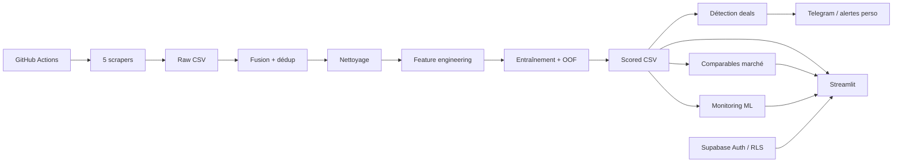

<div align="center">

# 🚗 AutoDeal Tunisie

**Plateforme d'intelligence du marché automobile tunisien : collecte multi-sources, estimation ML, comparables réels, détection d'opportunités et monitoring de fiabilité.**


</div>

---

## Pourquoi ce projet ?

AutoDeal Tunisie cherche à répondre à une question simple : **une voiture est-elle affichée à un prix cohérent avec le marché, et avec quel niveau de confiance ?**

Le projet ne se contente pas de prédire un prix. Il confronte plusieurs signaux :

- une **estimation Machine Learning** entraînée sur les annonces récentes ;
- une **valorisation indépendante par comparables réels** (médiane, Q25–Q75, P10–P90) ;
- le **nombre et l'homogénéité des comparables** ;
- la stabilité du modèle dans le temps ;
- des garde-fous métier avant toute alerte automatique ;
- le suivi longitudinal des annonces pour vérifier si les opportunités disparaissent réellement plus vite.

> Les prix collectés sont des **prix demandés**, pas des prix de transaction certifiés. Une annonce disparue est un proxy d'écoulement, pas une preuve de vente.

---

## Fonctionnalités

### Côté acheteur

- recherche et filtrage des annonces ;
- estimation d'un véhicule ;
- comparaison de plusieurs véhicules ;
- historique et santé du marché ;
- favoris et alertes personnalisées (Supabase) ;
- score AutoDeal et niveau de confiance séparés.

### Côté professionnel

- **Samsar** : opportunités, gain potentiel, ROI, liquidité, arbitrage géographique ;
- **Concessionnaire** : structure du marché, dépréciation, niveaux de prix, prime professionnelle ;
- accès contrôlé par rôle + abonnement.

### Côté Admin / ML

- comparaison des modèles ;
- validation out-of-fold ;
- GroupKFold marque-modèle ;
- holdout temporel ;
- source holdout ;
- MdAPE, MdAE, MAE, P90 de l'erreur ;
- couverture à ±5 %, ±10 %, ±15 % ;
- biais médian signé ;
- fiabilité par gamme de prix et segments ;
- drift du volume, du prix médian et du mix de sources ;
- SHAP et diagnostics de qualité des données.

---

## Sources de données

Le pipeline connaît cinq sources :

| Source | Statut dans le pipeline | Particularité |
|---|---|---|
| `automobile.tn` | principale | volume important, données structurées |
| `tayara.tn` | principale | gros volume de petites annonces |
| `automax.tn` | principale | source automobile directe |
| `sayyaratn.com` | optionnelle | rendu JavaScript / Playwright |
| `autocentral.tn` | optionnelle | agrégateur ; seules les provenances inédites sont conservées |

`autocentral.tn` republie notamment des annonces d'autres plateformes. Le scraper filtre la provenance afin de limiter les doublons, puis `core/merging_files.py` effectue encore une déduplication par lien.

---

## Architecture



### Pipeline principal

```text
scrapers/*
  ↓
core/merging_files.py
  ↓
core/nettoyer_base.py
  ↓
core/enrichir_base_avance.py
  ↓
core/modele_prediction.py
  ↓
core/detect_deals.py
  ↓
core/suivi_annonces.py
```

`main.py` orchestre ces étapes. Le workflow nocturne ajoute ensuite le quality gate, le monitoring de performance et les notifications.

---

## Modèle de prix

### Cible et validation

Le modèle prédit `log1p(Prix)` puis reconvertit la sortie en dinars. Les annonces publiées dans `tunisia-cars-scored.csv` reçoivent une estimation **out-of-fold** : chaque annonce est prédite par un modèle qui ne l'a pas utilisée pour son entraînement.

Les candidats actuels incluent notamment Ridge, RandomForest, HistGradientBoosting, CatBoost, LightGBM et XGBoost. Le choix ne repose pas uniquement sur une CV aléatoire : les meilleurs candidats sont aussi stress-testés sur :

- des groupes marque-modèle jamais vus (`GroupKFold`) ;
- les annonces les plus récentes (holdout temporel) ;
- chaque source laissée de côté à tour de rôle (source holdout).

### Features de production

**Numériques** :

```text
Kilométrage
Log_Kilometrage
Age_Vehicule
Age_Carre
Km_Par_An
Puissance_Fiscale
Cylindree
Segment_Vehicule
```

**Catégorielles** :

```text
Marque
Modèle
Energie
Boite_Vitesse
```

`Zone_Economique` reste volontairement hors du modèle de prix : elle est trop confondue avec la provenance des annonces. Elle reste disponible pour les analyses géographiques.

### Dernier diagnostic versionné

Le fichier `data/processed/diagnostics_modele.json` est généré par le pipeline. Au snapshot du **20 août 2026**, il indique notamment :

| Test | MdAPE |
|---|---:|
| CV out-of-fold du modèle retenu | **8,10 %** |
| Holdout temporel (20 % les plus récents) | **10,41 %** |
| GroupKFold marque-modèle | **17,67 %** |

Ces chiffres n'ont pas la même signification. **8,1 % de MdAPE ne veut pas dire “91,9 % de précision”.** Cela signifie que l'erreur absolue relative médiane est de 8,1 % sur le protocole OOF considéré.

La généralisation varie aussi selon les sources. Le source-holdout d'`autocentral.tn (facebook)` est nettement plus difficile dans le snapshot actuel (~29,6 % MdAPE). Pour éviter des faux positifs, les sources dont le source-holdout dépasse **20 %** (avec ≥30 observations de test) restent visibles dans l'app mais **ne déclenchent plus d'alerte automatique** tant que leur fiabilité n'est pas revenue sous le seuil.

---

## Fiabilité et monitoring ML

`core/suivi_performance.py` enregistre à chaque run :

- MdAPE ;
- erreur absolue médiane (MdAE, DT) ;
- MAE (DT) ;
- P90 de l'erreur relative ;
- part des estimations à ±5 %, ±10 % et ±15 % ;
- biais médian signé ;
- volume et composition du marché ;
- métriques par tranche de prix ;
- alertes de drift.

`core/model_reliability.py` permet en plus de localiser les poches d'erreur par :

- prix ;
- marque ;
- modèle ;
- âge ;
- kilométrage ;
- énergie.

La règle est simple : **on ne juge jamais une estimation seulement sur une moyenne globale**. Le volume (`n`), la queue d'erreur (P90), le biais et la stabilité temporelle comptent autant que le MdAPE.

Voir aussi [`MODEL_RELIABILITY.md`](MODEL_RELIABILITY.md).

---

## Détection des opportunités

Une annonce est candidate quand son prix est entre les seuils configurés dans `config.py` sous le prix estimé. Les garde-fous supplémentaires sont :

1. exclusion des annonces explicitement accidentées, pour pièces, moteur/boîte HS, sans papiers, non dédouanées ou destinées à l'export ;
2. plafond des décotes extrêmes ;
3. nombre minimum de comparables avant alerte Telegram ;
4. quarantaine automatique des sources dont le source-holdout ML est trop dégradé.

Une voiture **dédouanée** n'est pas exclue : seul le statut négatif (`non/pas/sans dédouanement`) l'est.

---

## Suivi longitudinal

`core/suivi_annonces.py` conserve :

- première et dernière observation ;
- prix initial et dernier prix ;
- statut active/disparue ;
- durée observée en ligne ;
- réapparitions ;
- historique du fait qu'une annonce a déjà été signalée comme opportunité.

Deux garde-fous évitent de créer de fausses disparitions lors d'un scraping incomplet :

- contrôle du volume global ;
- contrôle **par source**. Une seule source peut tomber sans faire s'effondrer le volume total, donc ses disparitions sont gelées indépendamment.

---

## Quality gate

Avant publication automatique, `core/quality_gate.py` vérifie :

- volume minimal par source principale ;
- volume global absolu et relatif au dernier run valide ;
- **fraîcheur de la dernière détection** par source ;
- complétude Prix / Marque / Modèle ;
- plausibilité des prix ;
- taux de doublons.

Le pipeline ne doit pas publier silencieusement un gros CSV ancien simplement parce qu'un scraper a échoué.

---

## Application Streamlit

La navigation est pilotée par rôle :

```text
ACHETER
  Accueil · Acheter · Comparateur · Santé du marché · Historique · Alertes · Mon compte · Tarifs

ESTIMER
  Calculateur · Assistant

PRO (selon rôle + abonnement)
  Concessionnaire · Samsar · Carte · Recherche avancée

ADMIN
  Admin
```

Le calculateur affiche deux avis distincts :

1. **ML Valuation** ;
2. **Market Comparable Valuation**.

Le score d'intérêt d'une annonce et le score de confiance de sa valorisation sont volontairement séparés.

---

## Supabase

Supabase gère uniquement la couche compte/SaaS :

```text
auth.users
profiles
subscriptions
favorites
alerts
notification_settings
alert_deliveries
payment_transactions
subscription_notifications
```

Les données automobiles principales restent dans `data/`.

Pour un projet neuf :

1. crée le projet Supabase ;
2. exécute **`supabase/schema.sql`** dans SQL Editor ;
3. configure Streamlit avec `SUPABASE_URL` + `SUPABASE_PUBLISHABLE_KEY` ;
4. configure les secrets backend dans GitHub Actions si tu utilises notifications/abonnements.

Documentation détaillée : [`SUPABASE_SETUP.md`](SUPABASE_SETUP.md).

---

## Installation

### Prérequis

- Python 3.11 recommandé ;
- Git ;
- Chromium pour les scrapers Playwright/Patchright.

### Installation locale

```bash
git clone https://github.com/iheb-bibani/AutoDeal-Tunisie.git
cd AutoDeal-Tunisie

python -m venv .venv
```

Activation :

```bash
# Windows
.venv\Scripts\activate

# Linux/macOS
source .venv/bin/activate
```

Puis :

```bash
python -m pip install --upgrade pip
pip install -r requirements.txt
python -m playwright install chromium
```

Pour les scrapers qui utilisent Patchright, installe également le navigateur correspondant si ton environnement le demande.

---

## Utilisation

### Lancer tout le pipeline

```bash
python main.py
```

### Lancer l'application

```bash
streamlit run app.py
```

### Rejouer seulement le modèle

```bash
python core/modele_prediction.py
python core/detect_deals.py
```

### Vérifier la qualité

```bash
python core/quality_gate.py
python core/suivi_performance.py
python verifier_sync.py
```

---

## Tests

```bash
python -m pytest tests/ -q
```

La CI exécute aussi :

- `compileall` sur les modules Python ;
- `verifier_sync.py` pour les contrats config/modèle/dépôt ;
- Ruff en mode informatif.

Les tests couvrent notamment le nettoyage, les exclusions métier, les comparables, les rôles/abonnements, le suivi des annonces, la fraîcheur du quality gate et les métriques de fiabilité ML.

---

## GitHub Actions

### CI

`.github/workflows/ci.yml`

Déclenchée sur push `main` et pull request.

### Pipeline nocturne

`.github/workflows/scraping.yml`

Collecte, pipeline, quality gate, monitoring, notifications et commit des données générées.

### Maintenance des abonnements

`.github/workflows/subscription-maintenance.yml`

Expire les périodes payées arrivées à terme et envoie les notifications backend lorsque Supabase/SMTP/Telegram sont configurés.

---

## Structure du dépôt

```text
AutoDeal-Tunisie/
├── .github/workflows/       # CI, scraping nocturne, maintenance SaaS
├── .streamlit/              # exemple de secrets publics Supabase
├── core/                    # pipeline data, ML, monitoring, validation
├── data/
│   ├── raw/                 # sorties des scrapers
│   ├── processed/           # jeux nettoyés/scorés + diagnostics
│   └── models/              # modèle sérialisé
├── scrapers/                # 5 collecteurs
├── services/                # Supabase + paiement
├── supabase/                # schéma canonique + migrations historiques
├── tests/                   # tests de non-régression
├── utils/                   # Telegram, alertes perso, maintenance backend
├── app.py                   # application Streamlit principale
├── product_views.py         # vues produit grand public / compte
├── config.py                # source centrale de configuration
├── main.py                  # orchestration du pipeline
├── MODEL_RELIABILITY.md     # méthodologie de fiabilité ML
└── README.md
```

Le dossier `_modularisation/` contient un travail de découpage/prototype et **n'est pas le runtime principal** actuel. Le runtime de production reste `app.py` + `product_views.py` + `core/` + `services/`.

---

## Limites connues

- prix affiché ≠ prix final de vente ;
- disparition d'annonce ≠ vente certifiée ;
- les sources ont des distributions différentes ;
- la généralisation à une marque/modèle jamais vus est beaucoup plus difficile que la CV standard ;
- les scrapers peuvent casser après un changement de HTML/anti-bot ;
- l'état réel du véhicule, l'historique d'entretien et les défauts visibles ne sont pas toujours disponibles dans les annonces ;
- une estimation AutoDeal est un **point de départ de négociation**, pas un diagnostic mécanique ni une garantie financière.

---

## Sécurité

- aucun mot de passe, token Telegram ou clé Supabase privée ne doit être commité ;
- Streamlit utilise uniquement une publishable/anon key Supabase ;
- la secret/service-role key est réservée au backend ;
- RLS est activée sur les données utilisateur ;
- les requêtes utilisateur sont en plus explicitement filtrées par `user_id` ;
- les données de carte bancaire ne transitent pas par AutoDeal : le checkout est hébergé chez le prestataire configuré.

---

## Licence

MIT — voir [`LICENSE`](LICENSE).
