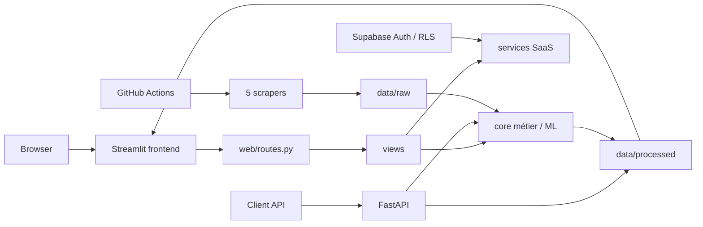

<div align="center">

# 🚗 AutoDeal Tunisie

**Plateforme d'intelligence du marché automobile tunisien : collecte multi-sources, estimation ML, comparables réels, détection d'opportunités, API et monitoring de fiabilité.**


</div>

---

## Objectif

AutoDeal Tunisie répond à une question simple : **une voiture est-elle affichée à un prix cohérent avec le marché, et avec quel niveau de confiance ?**

Le système combine plusieurs signaux indépendants :

- estimation Machine Learning entraînée sur les annonces récentes ;
- valorisation par comparables réels : médiane, Q25–Q75 et P10–P90 ;
- profondeur et homogénéité du marché comparable ;
- détection de décote anormale ;
- garde-fous métier et qualité de données ;
- suivi longitudinal des annonces ;
- monitoring de performance et de drift.

> Les prix collectés sont des **prix demandés**, pas des prix de transaction certifiés. Une annonce disparue est un proxy d'écoulement, pas une preuve de vente.

---

## V2 Architecture

La V2 sépare désormais clairement les responsabilités :



### Responsabilités

| Couche | Rôle |
|---|---|
| `app.py` | point d'entrée Streamlit très léger + router |
| `web/routes.py` | registre canonique des pages et URLs |
| `views/` | présentation Streamlit ; migration progressive des anciennes vues |
| `backend/` | API FastAPI indépendante de Streamlit |
| `core/` | nettoyage, feature engineering, ML, comparables, validation, monitoring |
| `services/` | Supabase, paiements et intégrations applicatives |
| `utils/` | notifications et tâches backend |
| `scrapers/` | collecte multi-sources |

L'ancien dossier `_modularisation/` a été supprimé : il dupliquait une partie de l'application sans être le runtime réel.

### Migration progressive sans régression fonctionnelle

L'ancien `app.py` de grande taille est conservé temporairement dans `views/legacy_dashboard.py`. Le nouvel `app.py` ne contient plus la logique métier des pages : il orchestre la navigation et délègue le rendu.

Cette étape permet de découper ensuite `legacy_dashboard.py` page par page sans réécrire tout le produit en une fois. Le comportement existant reste ainsi conservé pendant la migration.

---

## URLs propres

La navigation utilise maintenant le routeur natif de Streamlit (`st.Page`, `st.navigation`, `st.switch_page`). Chaque page possède une URL stable au lieu de garder la même URL pendant toute la session.

Exemples :

```text
/accueil
/acheter
/comparateur
/marche
/historique
/alertes
/compte
/tarifs
/estimer
/assistant
/pro-samsar
/pro-concessionnaire
/recherche-avancee
/carte
/admin
```

Les anciennes actions internes qui modifient encore `st.session_state["page"]` sont interceptées par une couche de compatibilité et transformées en **vraie navigation URL**. Elles pourront être migrées progressivement vers le nouveau router.

> **Pourquoi FastAPI ne gère pas les onglets Streamlit ?** FastAPI fournit des routes HTTP backend. L'URL visible d'une page Streamlit doit être gérée par le router frontend de Streamlit. AutoDeal utilise donc le bon outil à chaque niveau : Streamlit pour les URLs de pages, FastAPI pour les URLs d'API.

---

## API FastAPI

AutoDeal possède maintenant une API backend read-only versionnée.

### Démarrage local

```bash
uvicorn backend.main:app --reload --port 8000
```

Documentation interactive :

```text
http://127.0.0.1:8000/docs
```

ReDoc :

```text
http://127.0.0.1:8000/redoc
```

### Endpoints initiaux

| Méthode | Endpoint | Usage |
|---|---|---|
| `GET` | `/health` | santé du service |
| `GET` | `/api/v1/market/summary` | résumé du marché |
| `GET` | `/api/v1/listings` | recherche filtrée et paginée |
| `GET` | `/api/v1/deals` | opportunités détectées |
| `POST` | `/api/v1/valuation/comparables` | valorisation indépendante par comparables |

Exemple :

```bash
curl "http://127.0.0.1:8000/api/v1/listings?brand=Peugeot&model=208&max_price=50000&limit=20"
```

La première version de l'API est volontairement **read-only**. Les opérations sensibles liées aux comptes, abonnements et paiements restent protégées par Supabase/RLS jusqu'à l'introduction d'endpoints authentifiés dédiés.

CORS se configure avec :

```text
AUTODEAL_CORS_ORIGINS=http://localhost:8501,https://votre-frontend.example
```

---

## Fonctionnalités produit

### Acheteur

- recherche et filtrage ;
- estimation d'un véhicule ;
- comparaison de plusieurs annonces ;
- historique et santé du marché ;
- favoris et alertes persistants ;
- score AutoDeal ;
- score de confiance distinct du score d'opportunité.

### Samsar

- opportunités et gain potentiel ;
- ROI estimé ;
- profondeur du marché ;
- fenêtre d'achat ;
- arbitrage géographique ;
- accès conditionné au rôle et à l'abonnement.

### Concessionnaire

- structure du marché ;
- courbes de dépréciation corrigées de la composition ;
- niveaux de prix ;
- prime professionnelle ;
- analyses de parc.

### Admin / ML

- benchmark de modèles ;
- validation out-of-fold ;
- GroupKFold marque-modèle ;
- holdout temporel ;
- source holdout ;
- MdAPE, MdAE, MAE et P90 ;
- couverture ±5 %, ±10 %, ±15 % ;
- biais signé ;
- SHAP ;
- drift du prix, du volume et du mix de sources ;
- qualité du scraping.

---

## Sources

| Source | Statut | Particularité |
|---|---|---|
| `automobile.tn` | principale | volume important, structurée |
| `tayara.tn` | principale | petites annonces, gros volume |
| `automax.tn` | principale | source automobile directe |
| `sayyaratn.com` | optionnelle | rendu JavaScript |
| `autocentral.tn` | optionnelle | agrégateur ; provenances inédites uniquement |

La fusion finale déduplique également les annonces par lien.

---

## Pipeline Data / ML

```text
scrapers/*
  ↓
core/merging_files.py
  ↓
core/nettoyer_base.py
  ↓
core/enrichir_base_avance.py
  ↓
core/modele_prediction.py
  ↓
core/detect_deals.py
  ↓
core/suivi_annonces.py
```

`main.py` orchestre le pipeline. GitHub Actions ajoute le quality gate, le suivi de performance, les notifications et la publication des données validées.

### Modèle de prix

La cible est `log1p(Prix)`. Les prix publiés dans le jeu scoré sont calculés **out-of-fold** : une annonce n'est jamais évaluée par un modèle qui l'a utilisée pour son entraînement.

Candidats actuels : Ridge, RandomForest, HistGradientBoosting, CatBoost, LightGBM et XGBoost.

Features numériques de production :

```text
Kilométrage
Log_Kilometrage
Age_Vehicule
Age_Carre
Km_Par_An
Puissance_Fiscale
Cylindree
Segment_Vehicule
```

Features catégorielles :

```text
Marque
Modèle
Energie
Boite_Vitesse
```

`Zone_Economique` reste hors du modèle de prix à cause de son confounding avec la provenance des annonces.

### Dernier diagnostic versionné

Au snapshot du 20 août 2026 :

| Test | MdAPE |
|---|---:|
| CV out-of-fold du modèle retenu | **8,10 %** |
| Holdout temporel 20 % | **10,41 %** |
| GroupKFold marque-modèle | **17,67 %** |

**8,1 % de MdAPE ne signifie pas 91,9 % de précision.** Il s'agit de l'erreur absolue relative médiane dans ce protocole.

Le source-holdout d'`autocentral.tn (facebook)` est beaucoup plus difficile (~29,6 % dans ce snapshot). Les sources dépassant le seuil de fiabilité défini sont conservées pour l'observation mais peuvent être bloquées des alertes automatiques.

---

## Comparables indépendants

`core/market_valuation.py` construit un voisinage réel sans utiliser `Prix_Theorique` :

- même marque et modèle ;
- âge proche ;
- kilométrage proche ;
- énergie contrôlée quand disponible ;
- boîte contrôlée lorsque l'échantillon reste suffisant.

Il retourne notamment :

- nombre de comparables ;
- médiane ;
- P10 / P90 ;
- Q25 / Q75 ;
- largeur relative ;
- homogénéité ;
- niveau de confiance.

Cela permet de confronter **ML Valuation** et **Market Comparable Valuation** sans circularité.

---

## Quality gate et monitoring

`core/quality_gate.py` contrôle avant publication :

- volume par source ;
- volume global ;
- évolution par rapport au dernier run valide ;
- fraîcheur réelle des sources ;
- complétude ;
- plausibilité des prix ;
- doublons.

`core/suivi_performance.py` enregistre dans le temps : MdAPE, MdAE, MAE, P90, couverture à ±5/10/15 %, biais, volume, mix des sources et drift.

`core/suivi_annonces.py` suit première/dernière observation, prix initial/dernier prix, disparition, réapparition et durée observée. Les disparitions sont protégées contre les scrapings incomplets **globalement et par source**.

---

## Supabase / SaaS

Supabase gère :

```text
auth.users
profiles
subscriptions
favorites
alerts
notification_settings
alert_deliveries
payment_transactions
subscription_notifications
```

Les politiques RLS isolent les données utilisateur. Les clés `service-role` / secret restent réservées au backend et aux workflows serveur.

Pour un nouveau projet, exécuter `supabase/schema.sql`, puis configurer les secrets décrits dans [`SUPABASE_SETUP.md`](SUPABASE_SETUP.md).

---

## Installation locale

Prérequis : Python 3.11 recommandé, Git et Chromium pour les scrapers.

```bash
git clone https://github.com/iheb-bibani/AutoDeal-Tunisie.git
cd AutoDeal-Tunisie
python -m venv .venv
```

Activation :

```bash
# Windows
.venv\Scripts\activate

# Linux/macOS
source .venv/bin/activate
```

Installation :

```bash
python -m pip install --upgrade pip
pip install -r requirements.txt
python -m playwright install chromium
```

---

## Lancer AutoDeal

### Frontend

```bash
streamlit run app.py
```

### API

Dans un second terminal :

```bash
uvicorn backend.main:app --reload --port 8000
```

### Pipeline complet

```bash
python main.py
```

### Réentraîner uniquement

```bash
python core/modele_prediction.py
python core/detect_deals.py
```

### Contrôles

```bash
python core/quality_gate.py
python core/suivi_performance.py
python verifier_sync.py
```

---

## Tests et CI

```bash
python -m pytest tests/ -q
```

La suite couvre notamment :

- nettoyage et normalisation ;
- exclusions métier ;
- comparables ;
- rôles et abonnements ;
- suivi des annonces ;
- quality gate ;
- fiabilité ML ;
- registre des URLs frontend ;
- endpoints FastAPI.

La CI compile également les modules Python et exécute les contrôles de cohérence du dépôt.

---

## Structure du dépôt

```text
AutoDeal-Tunisie/
├── .github/workflows/       # CI, pipeline nocturne, maintenance SaaS
├── .streamlit/              # configuration Streamlit
├── backend/                 # FastAPI + contrats + repository read-only
│   ├── main.py
│   ├── repository.py
│   └── schemas.py
├── core/                    # data engineering, ML, comparables, monitoring
├── data/
│   ├── raw/
│   ├── processed/
│   └── models/
├── scrapers/                # collecteurs
├── services/                # Supabase et paiement
├── supabase/                # schéma et migrations
├── tests/                   # non-régression + API + routing
├── utils/                   # notifications et maintenance
├── views/
│   └── legacy_dashboard.py  # transition : vues à découper progressivement
├── web/
│   └── routes.py            # routes frontend canoniques
├── app.py                   # shell Streamlit + navigation URL
├── product_views.py         # vues produit, prochaine cible de migration
├── config.py                # configuration centrale
├── main.py                  # orchestration pipeline
└── README.md
```

---

## Étapes suivantes de la migration V2

La migration est volontairement incrémentale. Les prochaines extractions pourront être réalisées sans modifier l'UX :

1. déplacer les vues produit de `product_views.py` vers `views/public/` ;
2. extraire `Concessionnaire`, `Samsar`, `Calculateur`, `Assistant` et `Admin` de `views/legacy_dashboard.py` ;
3. centraliser composants visuels et formatters dans `ui/` ;
4. déplacer les analyses réutilisables restantes vers `core/` ou `services/` ;
5. faire consommer progressivement l'API FastAPI au frontend lorsque cela apporte un bénéfice réel ;
6. ajouter authentification API pour les futures opérations privées.

Le principe : **aucun big-bang rewrite**. Chaque extraction doit rester testable et réversible.

---

## Sécurité

- aucun secret réel dans le dépôt ;
- `.env`, `.streamlit/secrets.toml`, clés privées et logs sont ignorés ;
- Supabase public key uniquement côté frontend ;
- service-role uniquement côté backend/CI ;
- FastAPI public initialement read-only ;
- checkout hébergé : AutoDeal ne stocke pas de PAN/CVV.

---

## Licence

MIT — voir [`LICENSE`](LICENSE).
