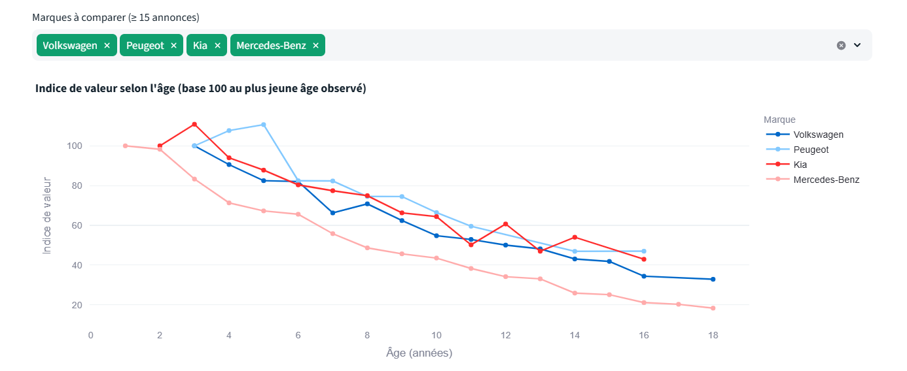
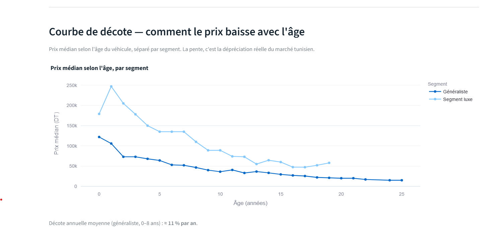
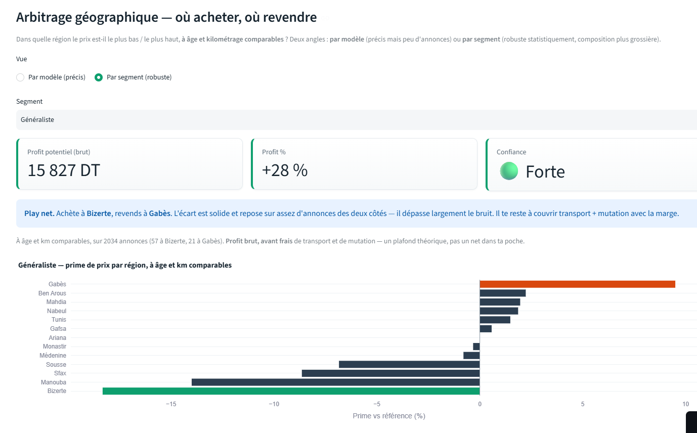
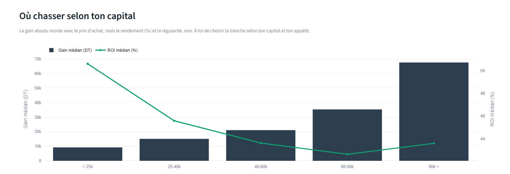
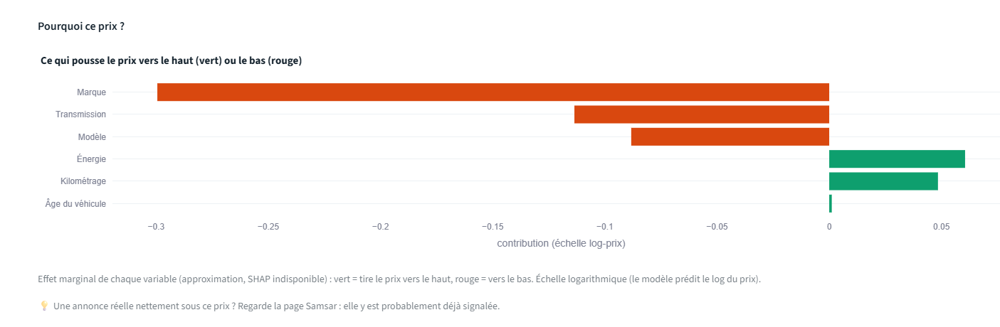
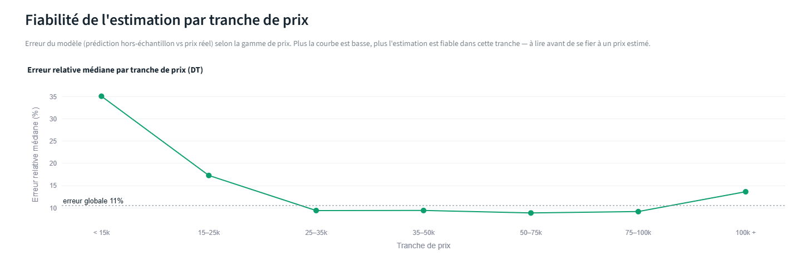
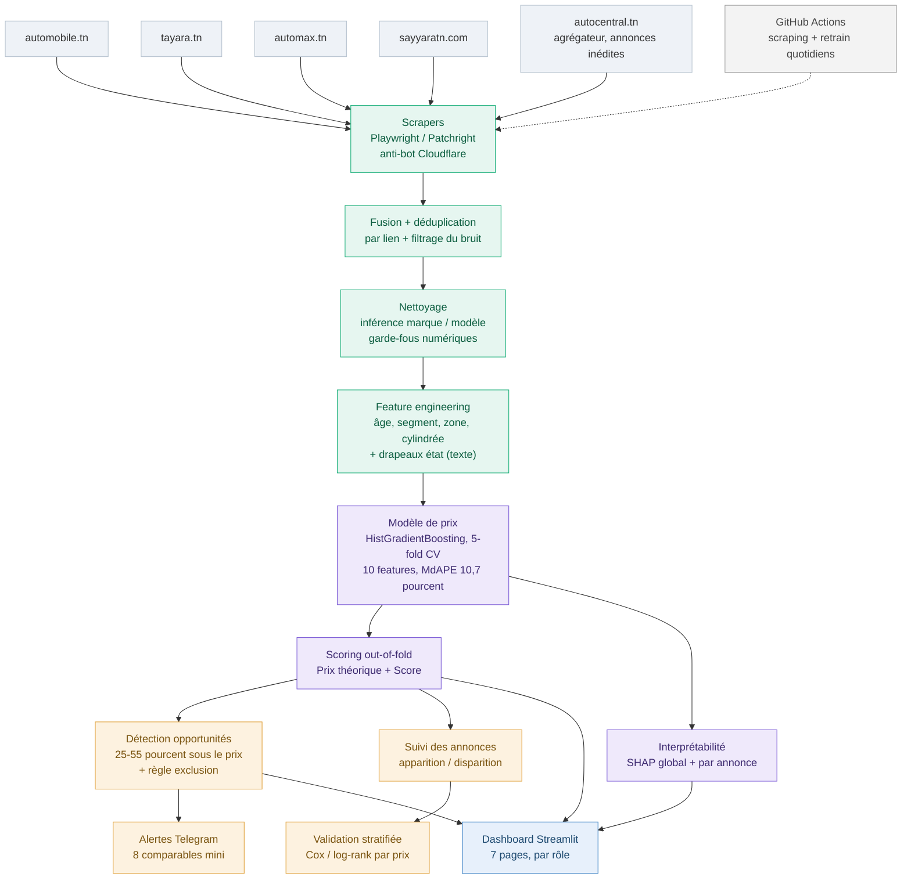
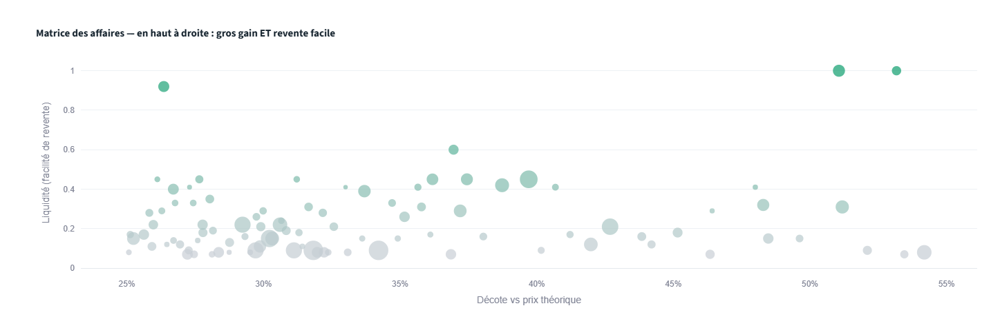
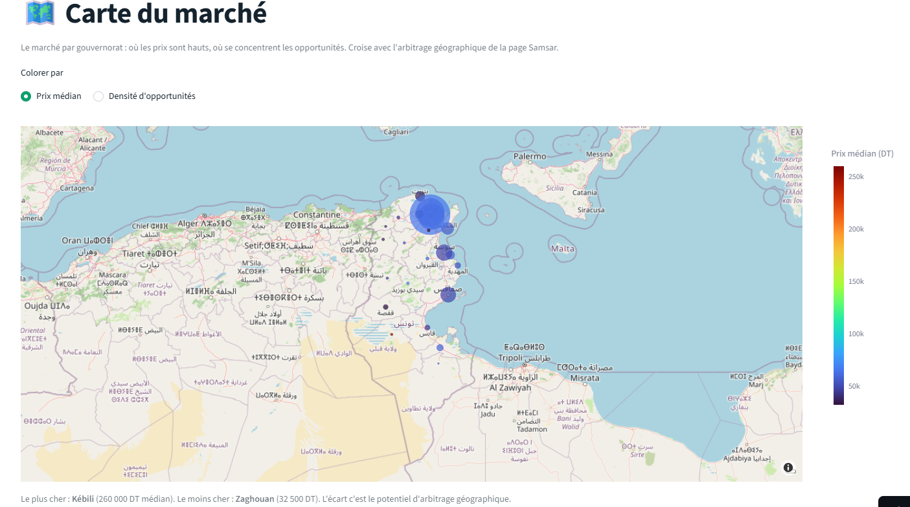
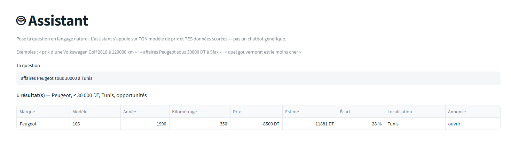

<div align="center">

# 🚗 AutoDeal Tunisie

**Détection automatisée de bonnes affaires sur le marché tunisien de l'occasion, propulsée par le Machine Learning.**

Scraping multi-sources → nettoyage → feature engineering → modèle de prix → détection d'opportunités → dashboard décisionnel — ré-exécuté chaque nuit, entièrement automatisé.


</div>

---

## Aperçu

<table>
<tr>
<td align="center"><b>Dépréciation par marque (composition corrigée)</b></td>
<td align="center"><b>Dépréciation par segment</b></td>
</tr>
<tr>
<td></td>
<td></td>
</tr>
<tr>
<td align="center"><b>Arbitrage géographique à confiance graduée</b></td>
<td align="center"><b>Où chasser selon ton capital</b></td>
</tr>
<tr>
<td></td>
<td></td>
</tr>
<tr>
<td align="center"><b>Calculateur — « pourquoi ce prix ? »</b></td>
<td align="center"><b>Fiabilité du modèle par tranche</b></td>
</tr>
<tr>
<td></td>
<td></td>
</tr>
</table>

---

## Table des matières

- [En bref](#en-bref)
- [Les 5 sources de données](#les-5-sources-de-données)
- [Architecture](#architecture)
- [Le pipeline en détail](#le-pipeline-en-détail)
- [Le dashboard (7 pages, par rôle)](#le-dashboard-7-pages-par-rôle)
- [Le modèle de prix](#le-modèle-de-prix)
- [Analyses & honnêteté méthodologique](#analyses--honnêteté-méthodologique)
- [Choix de conception notables](#choix-de-conception-notables)
- [Stack technique](#stack-technique)
- [Installation](#installation)
- [Utilisation](#utilisation)
- [Structure du projet](#structure-du-projet)
- [Tests](#tests)
- [Automatisation (CI)](#automatisation-ci)
- [Limites assumées](#limites-assumées)
- [Roadmap](#roadmap)
- [Licence](#licence)

---

## En bref

AutoDeal collecte chaque jour les annonces de voitures d'occasion de **plusieurs sites tunisiens**, estime le **juste prix** de chaque véhicule avec un modèle entraîné sur le marché récent, et signale celles affichées nettement en dessous — avec une **explication du pourquoi**, une **fourchette de confiance** calibrée, une **règle métier** qui écarte les épaves, et des **alertes Telegram** sur les affaires solides.

Ce n'est pas un agrégateur d'annonces : c'est un outil d'**aide à la décision** qui répond à des questions concrètes — *ce véhicule est-il correctement prix ? est-ce une vraie affaire ? à quel âge acheter, combien de temps garder ? où le marché est-il le moins cher ? à quel niveau de confiance puis-je agir ?*

> **Mots-clés** : `Machine Learning` · `Python` · `Web Scraping` · `Playwright` · `scikit-learn` · `SHAP` · `Streamlit` · `Pandas` · `GitHub Actions` · `CI/CD` · `MLOps` · `Price Prediction` · `Vehicle Valuation` · `Survival Analysis` · `Geographic Arbitrage`

---

## Les 5 sources de données

AutoDeal agrège **5 sources**, chacune scrapée par un module dédié (`scrapers/scraper_*.py`). Toutes sont rendues en JavaScript → collecte via **Playwright / Patchright** (gestion de l'anti-bot Cloudflare).

| Source | Type | Rôle |
|---|---|---|
| **automobile.tn** | Concessionnaires & particuliers | Source directe, structurée. |
| **tayara.tn** | Petites annonces généralistes | Source directe, gros volume. |
| **automax.tn** | Annonces auto | Source directe. |
| **sayyaratn.com** | Annonces auto (React/Next.js) | Source directe, extraction JS résiliente. |
| **autocentral.tn** | **Agrégateur** | Dédup par provenance (ci-dessous). |

### Le cas autocentral.tn : dédup par provenance

autocentral.tn est un **agrégateur** qui republie les annonces d'automobile.tn, tayara.tn et Facebook. Le scraper naïvement dupliquerait les sources déjà collectées.

La provenance est lisible dans l'URL de chaque photo (`car-posts/AUTOMOBILETN-…`, `car-posts/TAYARA-…`, `car-posts/FACEBOOK-…`). Le scraper **ne garde que les annonces dont la source n'est pas déjà collectée en direct** (typiquement **Facebook**) — un dédup par **provenance**, plus fiable qu'un rapprochement titre/prix. La déduplication finale entre toutes les sources se fait par lien unique dans `merging_files.py`, où sayyaratn et autocentral sont intégrées en **sources optionnelles**.

---

## Architecture



Le pipeline suit une logique **Medallion** (raw → interim → processed). Chaque étape est un script isolé et rejouable, orchestré par `main.py`. Un scraper qui échoue n'interrompt pas les autres ; un pipeline interrompu ne publie pas de données partielles.

---

## Le pipeline en détail

| Étape | Fichier | Rôle |
|---|---|---|
| **1. Collecte** | `scrapers/scraper_*.py` (×5) | Playwright / Patchright, anti-bot Cloudflare, écriture incrémentale, dédup par lien ; autocentral filtré par provenance. |
| **2. Fusion** | `core/merging_files.py` | Schéma commun, dédup par lien, filtrage du bruit ; sayyaratn et autocentral en sources optionnelles. |
| **3. Nettoyage** | `core/nettoyer_base.py` | Inférence marque / modèle en 3 niveaux, garde-fous prix / km / année, fenêtre de fraîcheur (≤ 60 jours). |
| **4. Enrichissement** | `core/enrichir_base_avance.py` | Variables dérivées (âge, segment, zone, cylindrée) + drapeaux d'état texte. |
| **5. Modélisation** | `core/modele_prediction.py` | Sélection de modèle en CV, scoring out-of-fold, export du modèle + importance SHAP. |
| **6. Détection** | `core/detect_deals.py` | Opportunités 25–55 % sous le prix, règle métier d'exclusion, seuil de comparables pour l'alerte. |
| **7. Suivi** | `core/suivi_annonces.py` | Apparition / disparition (proxy d'écoulement), réapparitions. |
| **8. Validation** | `core/analyser_validation.py` | Survie stratifiée par prix (Cox, repli Mann-Whitney). |
| **Notifications** | `utils/send_telegram.py` | Alertes Telegram sur les affaires solides. |

---

## Le dashboard (7 pages, par rôle)

Navigation groupée par rôle métier (sections + bouton actif surligné).

<div align="center">

</div>

**🏢 CONCESSIONNAIRE** — *comprendre & valoriser le parc*
- **Concessionnaire** : parts de marché, prix médian par marque, **courbes de dépréciation débiaisées**, un **tableau de composition par âge** (le modèle dominant par tranche d'âge, qui *matérialise* le biais de composition), et une **stratégie d'achat** par segment.
- **Calculateur** : estimation d'une voiture, **fourchette de confiance**, **décomposition « pourquoi ce prix »**, **comparables** réels.

**🤝 SAMSAR** — *achat-revente*
- **Samsar** : opportunités chiffrées, **matrice des affaires** (gain × liquidité), **où chasser selon ton capital** (gain absolu vs ROI vs régularité), **arbitrage géographique à confiance graduée**, explication par annonce.

**🔎 EXPLORER** — *outils transverses*
- **Recherche** (filtres instantanés) · **Carte** (marché par gouvernorat) · **Assistant** (langage naturel adossé au modèle).

**🛠️ ADMIN** — *technique*
- Sélection du modèle, **fiabilité par tranche de prix**, **importance SHAP globale**, **validation** des opportunités, **santé du scraping**.

<table>
<tr>
<td></td>
<td></td>
</tr>
<tr>
<td align="center"><em>Matrice des affaires (Samsar)</em></td>
<td align="center"><em>Carte par gouvernorat</em></td>
</tr>
<tr>
<td></td>
<td></td>
</tr>
<tr>
<td align="center"><em>Assistant en langage naturel</em></td>
<td align="center"><em>Où chasser selon ton capital</em></td>
</tr>
</table>

---

## Le modèle de prix

- **Algorithme** : comparaison Ridge / RandomForest / **HistGradientBoosting** en CV 5-fold, sélection sur l'**erreur relative médiane (MdAPE ≈ 10,7 %)** — robuste aux extrêmes.
- **Scoring out-of-fold** : le prix théorique de chaque annonce est prédit par un modèle qui **ne l'a jamais vue** (`cross_val_predict`). Pas de fuite, pas de sur-optimisme sur les affaires. Le modèle final est ré-entraîné sur 100 % des données pour le calculateur.
- **10 features, sélectionnées par ablation** : audit systématique (retrait d'une variable à la fois). 5 variables mortes/redondantes retirées sans perte de précision.
  - Numériques : `Kilométrage`, `Age_Vehicule`, `Puissance_Fiscale`, `Cylindree`, `Segment_Vehicule`, `Zone_Economique`.
  - Catégorielles : `Marque`, `Modèle`, `Energie`, `Transmission`.
- **Cible** : `log1p(Prix)` (prix log-normaux).
- **Interprétabilité robuste** : la décomposition « pourquoi ce prix » utilise **SHAP** si disponible, sinon un **repli par perturbation** (effet marginal de chaque variable = prédiction réelle − prédiction avec la variable ramenée à sa médiane). L'explication s'affiche donc **toujours**, même si shap n'est pas installé sur l'environnement de déploiement.
- **Détection d'opportunités** : affaire si le prix est **25 à 55 %** sous l'estimation. Une **règle métier** écarte en plus les titres « accidentée / pièces / HS / sans papiers / export ».
- **Cohérence garantie** : un test vérifie que les features du modèle picklé correspondent à `config.py`.

---

## Analyses & honnêteté méthodologique

Ce qui distingue AutoDeal d'un simple tableau de bord : chaque analyse a été **confrontée aux données réelles et corrigée quand elle mentait**.

### Dépréciation — des vues cohérentes et débiaisées
- **Prix médian par âge (par segment)** : la décote est mesurée **à partir de 2 ans** (avant, c'est la **prime du neuf**, pas de la dépréciation d'occasion). Une **règle robuste** protège la courbe : *une voiture d'occasion ne prend pas de valeur en vieillissant*, donc toute remontée en tête de courbe (échantillon quasi-neuf, rare et biaisé vers l'entrée de gamme) est coupée — sans seuil fixe fragile.
- **Profil par marque, corrigé de la composition** : régression `log(prix) ~ modèle + âge` (les indicatrices de modèle absorbent le changement de parc). Même règle « pas de remontée » + re-base à 100 sur le premier âge fiable. **Limite assumée** : cette correction n'est valable que s'il y a du **recouvrement de modèles entre âges** ; sans recouvrement (ex. 208 à 3 ans, 3008 à 5 ans), âge et modèle deviennent inséparables et la correction est instable — d'où l'importance de la règle de protection.
- **Tableau de composition par âge** : le modèle dominant par tranche d'âge (global ou par segment). Il *montre* le biais : les jeunes annonces sont des modèles récents et chers, les vieilles des économiques anciennes — le prix médian chute en partie parce qu'on ne regarde plus les mêmes voitures.
- **Décote par tranche d'âge** : révèle que le **généraliste tunisien tient sa valeur au début puis décroche**, tandis que le **luxe décroche plus tôt** — plus juste que le cliché « falaise puis plateau ».

### Arbitrage géographique à confiance graduée
Régression `log(prix) ~ âge + km + région` isolant l'écart par gouvernorat **à âge et km comparables**. Présenté comme une **action** : 🟢 **Forte** / 🟡 **Moyenne** / 🔴 **Faible** selon le nombre d'annonces des deux côtés et la taille de l'écart ; profit potentiel (DT), profit (%), zones d'achat/revente. Honnêteté intégrée : profit **brut, avant frais** (transport + mutation), échantillons affichés. Deux angles : **par modèle** (précis) ou **par segment** (robuste statistiquement).

### « Où chasser selon ton capital »
Par tranche de prix d'achat : gain absolu (monte avec le prix), ROI (%) (descend), et **régularité** = ROI médian ÷ dispersion (un Sharpe-*like*). ⚠️ Ce n'est **pas** un Sharpe financier : la dispersion mêle la variété réelle des affaires et l'erreur du modèle, et n'inclut pas le risque de revente (à venir avec le suivi).

### Validation statistique contrôlée des opportunités
Analyse de survie **stratifiée par prix** (Cox, repli Mann-Whitney) — pas une comparaison brute qui confondrait « c'est une affaire » et « c'est une petite voiture pas chère ». Le contrôle par prix ajuste le principal facteur de confusion, mais reste une analyse **observationnelle** (pas une preuve causale au sens strict : pas d'intervention, confondants résiduels possibles). Prête ; s'activera quand le suivi des disparitions aura accumulé de l'historique.

---

## Choix de conception notables

- **Scoring out-of-fold** — affaires réelles, pas artefact d'overfitting.
- **Sélection de features par ablation** — décision par ablation, pas par importance SHAP (qui divergent).
- **Règles métier + ML** — le ML estime, une règle écarte les épaves.
- **Dédup par provenance** (agrégateur autocentral).
- **Décisions graduées par la confiance** — l'arbitrage dit *à quel point* c'est fiable.
- **Interprétabilité sans dépendance dure** — SHAP si dispo, sinon repli par perturbation.
- **Configuration centralisée** — `config.py` = source unique de vérité.
- **Versions épinglées à l'exact** — cohérence du modèle picklé entre dev / CI / Cloud.

---

## Stack technique

| Domaine | Outils |
|---|---|
| **Scraping** | Playwright, Patchright, BeautifulSoup |
| **Data** | Pandas, NumPy — Medallion (raw / interim / processed) |
| **ML** | scikit-learn (HistGradientBoosting), SHAP, joblib |
| **Stats** | scipy (Mann-Whitney stratifié), lifelines *(optionnel, Cox)* |
| **App** | Streamlit, Plotly |
| **Automation** | GitHub Actions |
| **Notifications** | Telegram Bot API |
| **Qualité** | pytest (66 tests) |

---

## Installation

```bash
git clone https://github.com/iheb-bibani/AutoDeal-Tunisie.git
cd AutoDeal-Tunisie
python -m venv .venv           # Python 3.10 recommandé
# Windows : .venv\Scripts\activate   |   macOS/Linux : source .venv/bin/activate
pip install -r requirements.txt
python -m playwright install chromium
```

> ⚠️ **Versions figées, volontaire.** Le `.pkl` embarque un état interne scikit-learn **et** numpy. Si l'environnement qui charge le modèle diffère de celui qui l'a entraîné, le dépickle échoue (`InconsistentVersionWarning`, voire `PCG64 is not a known BitGenerator module`). Projet figé sur **scikit-learn 1.7.2 / numpy 1.26.4** (compatibles Python 3.10 ; scikit-learn ≥ 1.8 exige Python 3.11+). Régénère le modèle **dans l'environnement qui le servira**.

---

## Utilisation

```bash
python main.py                          # pipeline complet (5 sources)
python scrapers/scraper_sayyarat.py     # un seul scraper
python core/modele_prediction.py        # ré-entraîner + SHAP
python core/detect_deals.py             # recalculer les opportunités
python core/analyser_validation.py      # analyser la validité du détecteur
streamlit run app.py                    # dashboard
python -m pytest tests/ -q              # tests (66 passed)
python verifier_sync.py                 # contrôle de cohérence du dépôt
```

---

## Structure du projet

```
AutoDeal-Tunisie/
├── app.py                        # Dashboard Streamlit (7 pages, par rôle)
├── main.py                       # Orchestration du pipeline
├── config.py                     # Configuration centralisée (source unique de vérité)
├── logger.py
├── requirements.txt
├── verifier_sync.py              # Contrôle de cohérence du dépôt
│
├── scrapers/                     # 5 scrapers
│   ├── scraper_automobile.py
│   ├── scraper_tayara.py
│   ├── scraper_automax.py
│   ├── scraper_sayyarat.py
│   └── scraper_autocentral.py    # agrégateur : ne garde que les annonces inédites
│
├── core/
│   ├── merging_files.py
│   ├── nettoyer_base.py
│   ├── enrichir_base_avance.py
│   ├── modele_prediction.py
│   ├── detect_deals.py
│   ├── suivi_annonces.py
│   └── analyser_validation.py
│
├── utils/
│   ├── common.py
│   └── send_telegram.py
│
├── tests/                        # 66 tests pytest
│
├── data/
│   ├── raw/          # CSV bruts par source
│   ├── processed/    # données nettoyées, scorées, diagnostics, SHAP
│   └── models/       # modele_prix.pkl
│
├── docs/screenshots/  # captures pour ce README
└── .github/workflows/ # CI : scraping + retrain quotidiens
```

---

## Tests

**66 tests pytest**, ciblés sur le code le plus fragile : inférence marque/modèle et garde-fous (`test_nettoyer_base`, `test_guardrails`), normalisations de fusion (`test_merging`), règles d'exclusion et drapeaux d'état (`test_exclusion`, `test_drapeaux_etat`), suivi (`test_suivi`), validation stratifiée (`test_validation`), et cohérence config ↔ modèle picklé (`test_config_source_unique`).

```bash
python -m pytest tests/ -q     # 66 passed
```

---

## Automatisation (CI)

Deux workflows séparés, **code** vs **données** :

- **`ci.yml`** — sur chaque push / pull request : installe les dépendances, lance les **66 tests pytest**, vérifie la **cohérence du dépôt** (`verifier_sync.py`, config ↔ modèle picklé), et passe **ruff** (informatif). La CI code ne dépend pas du scraping.
- **`scraping.yml`** — la nuit (cron) **et** manuel (`workflow_dispatch`) : scraping (5 sources) → nettoyage → ré-entraînement → détection → alertes. Avant publication, un **quality gate dynamique** (`core/quality_gate.py`) contrôle le volume vs une **référence glissante** (détecte un effondrement 5 800 → 720), les planchers par source, la complétude (prix / marque / modèle), la plausibilité des prix et les doublons — il bloque la publication de données dégradées. Publication différenciée (pipeline OK → raw + processed + models ; KO → raw seul), cache pip, verrou de concurrence, boucle de publication en rebase.

---

## Limites assumées

- **Précision plafonnée aux extrêmes de prix** (< 15 k et > 100 k DT), visible dans la courbe de fiabilité (Admin). Les intervalles de confiance en tiennent compte.
- **État réel du véhicule encore partiel** : rarement structuré, il vit dans le texte des descriptions. La dérivation de drapeaux est en place ; en attendant, la règle d'exclusion écarte les cas flagrants.
- **Liquidité réelle (vitesse de revente) pas encore mesurée** : elle attend l'accumulation du suivi des disparitions. D'où le profit *brut* de l'arbitrage et la validation « prête mais en attente d'historique ».

Le plafond de performance ici, ce sont **les données** (état, historique d'écoulement), pas l'algorithme.

---

## Roadmap

- [ ] Scraper systématiquement la description → drapeaux d'état pleinement actifs.
- [ ] NLP léger pour extraire l'état et les options du texte.
- [ ] Vraie liquidité (durée d'écoulement) → arbitrage et samsar ajustés du risque de revente.
- [ ] Validation longitudinale en conditions réelles.
- [ ] Carte choroplèthe (polygones par gouvernorat) si un GeoJSON fiable est disponible.
- [ ] CI : `ruff` + `black` avant merge, badge de couverture.

---

## Licence

Distribué sous licence **MIT**. Voir le fichier `LICENSE`.

---

<div align="center">
<sub>Construit pour transformer des milliers d'annonces bruitées en décisions d'achat chiffrées et honnêtes.</sub>
</div>
